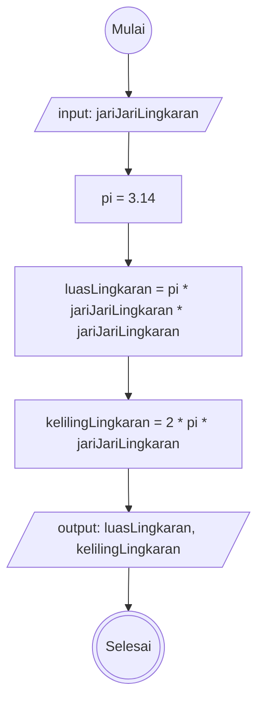

# Algoritma Javascript1
## Task 1
### Flowchart dari task1.js

```mermaid
flowchart TD
start@{shape: circle, label: "Mulai"}
input-r@{shape: lean-r, label: "input: jariJariLingkaran"}
pi@{shape: rect, label: "pi = 3.14"}
hitungLuas@{shape: rect, label: "luasLingkaran = pi * jariJariLingkaran * jariJariLingkaran"}
hitungKeliling@{shape: rect, label: "kelilingLingkaran = 2 * pi * jariJariLingkaran"}
output@{shape: lean-r, label: "output: luasLingkaran, kelilingLingkaran"}
stop@{shape: dbl-circ, label: "Selesai"}

start --> input-r
input-r-->pi
pi-->hitungLuas
hitungLuas-->hitungKeliling
hitungKeliling-->output
output-->stop
```