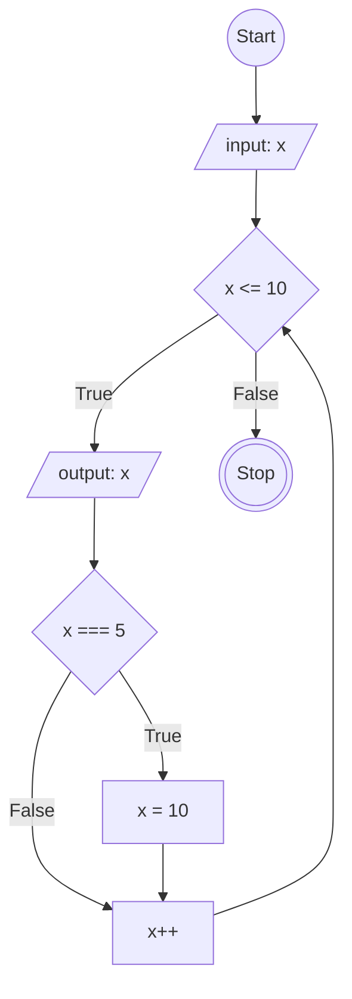
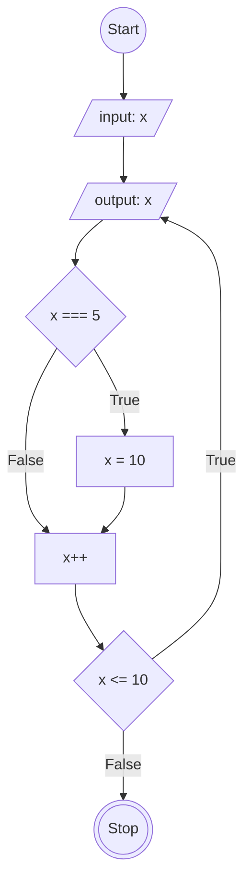

# Flowchart Loop

## For Loop

```mermaid
flowchart TD

start@{shape: circle, label: "Start"}
init@{shape: lean-r, label: "input: x"}
logX@{shape: lean-r, label: "output: x"}
isTrue@{shape: diamond, label: "x <= 10"}
isTrue2@{shape: diamond, label: "x === 5"}
true@{shape: rect, label: "x = 10"}
incr@{shape: rect, label: "x++"}
stop@{shape: dbl-circ, label: "Stop"}


start-->init
init-->isTrue
isTrue--True-->logX
isTrue--False-->stop
logX-->isTrue2
isTrue2--True-->true
isTrue2--False-->incr
true-->incr
incr-->isTrue
```

## FLowchart Do-While Loop

```mermaid
flowchart TD

start@{shape: circle, label: "Start"}
init@{shape: lean-r, label: "input: x"}
logX@{shape: lean-r, label: "output: x"}
isTrue@{shape: diamond, label: "x <= 10"}
isTrue2@{shape: diamond, label: "x === 5"}
true@{shape: rect, label: "x = 10"}
incr@{shape: rect, label: "x++"}
stop@{shape: dbl-circ, label: "Stop"}

start-->init
init-->logX
logX-->isTrue2
isTrue2--True-->true
isTrue2--False-->incr
isTrue--True-->logX
isTrue--False-->stop
true-->incr
incr-->isTrue
```