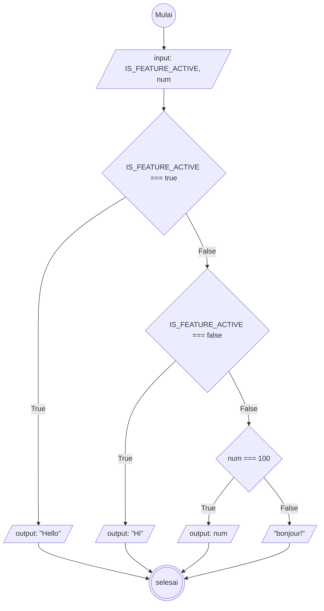

# Flowchart Switch

```mermaid
flowchart TD

start@{shape: circle, label: "Mulai"}
input@{shape: lean-r, label: "input: IS_FEATURE_ACTIVE, num"}
isActive@{shape: diamond, label: "IS_FEATURE_ACTIVE === true"}
isActive2@{shape: diamond, label: "IS_FEATURE_ACTIVE === false"}
active@{shape: lean-r, label: 'output: "Hello"'}
nonactive@{shape: lean-r, label: 'output: "Hi"'}
isNum100@{shape: diamond, label: "num === 100"}
100@{shape: lean-r, label: "output: num"}
bonjour@{shape: lean-r, label: '"bonjour!"'}
stop@{shape: dbl-circ, label: "selesai"}


start-->input
input-->isActive
isActive--True-->active
isActive--False-->isActive2
isActive2--True-->nonactive
isActive2--False-->isNum100
isNum100--True-->100
isNum100--False-->bonjour
100-->stop
bonjour-->stop
active-->stop
nonactive-->stop

```