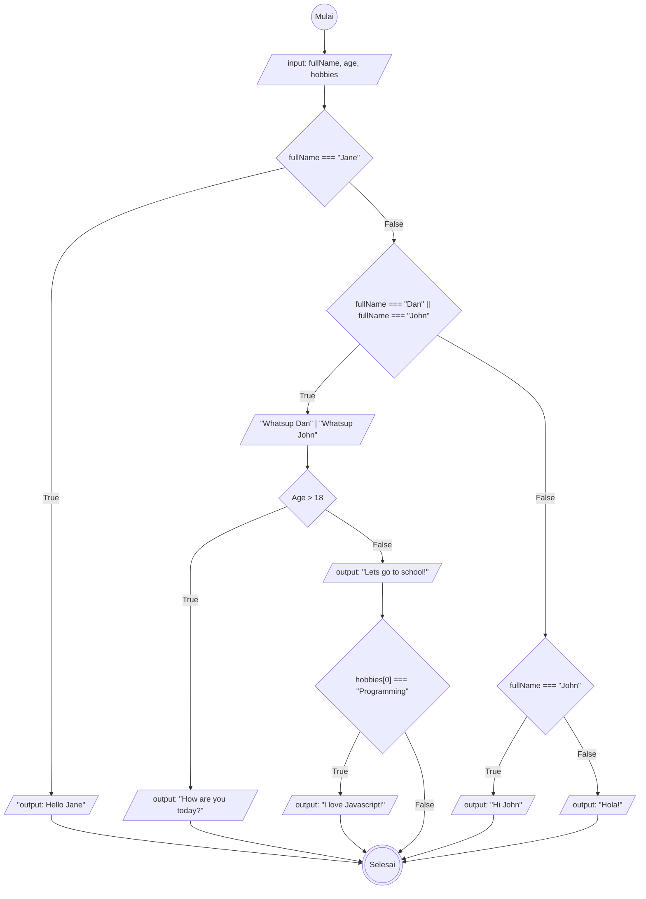

# Flowchart Percabangan

```mermaid
flowchart TD

start@{shape: circle, label: "Mulai"}
varInput@{shape: lean-r, label: "input: fullName, age, hobbies"}
isJane@{shape: diamond, label: 'fullName === "Jane"'}
trueJane@{shape: lean-r, label: '"output: Hello Jane"'}
falseJane@{shape: diamond, label: 'fullName === "Dan" || fullName === "John"'}
trueDanJohn@{shape: lean-r, label: '"Whatsup Dan" | "Whatsup John"'}
isAge@{shape: diamond, label: "Age > 18"}
trueAge@{shape: lean-r, label: 'output: "How are you today?"'}
falseAge@{shape: lean-r, label: 'output: "Lets go to school!"'}
isHobbies@{shape: diamond, label: 'hobbies[0] === "Programming"'}
trueHobbies@{shape: lean-r, label: 'output: "I love Javascript!"'}
isJohn@{shape: diamond, label: 'fullName === "John"'}
trueJohn@{shape: lean-r, label: 'output: "Hi John"'}
falseJohn@{shape: lean-r, label: 'output: "Hola!"'}

stop@{shape: dbl-circ, label: "Selesai"}


start-->varInput
varInput-->isJane
isJane--True-->trueJane
isJane--False-->falseJane
falseJane--True-->trueDanJohn
trueDanJohn-->isAge
isAge--True-->trueAge
isAge--False-->falseAge
falseAge-->isHobbies
isHobbies--True-->trueHobbies
isHobbies--False-->stop
falseJane--False-->isJohn
isJohn--True-->trueJohn
isJohn--False-->falseJohn
trueJane-->stop
trueAge-->stop
trueHobbies-->stop
trueJohn-->stop
falseJohn-->stop
```