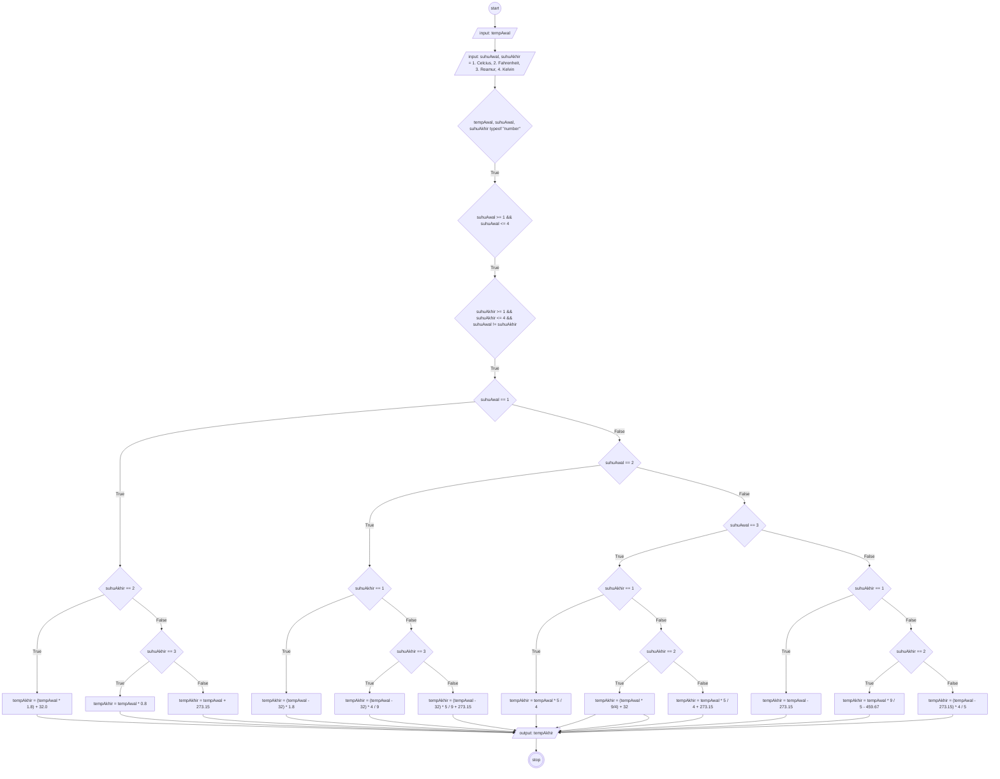

# Flowchart Konverter Suhu

```mermaid
flowchart TD
start@{shape: circle, label: "start"}

inputTemp@{shape: lean-r, label: "input: tempAwal"}
inputSuhuAwalAkhir@{shape: lean-r, label: "input: suhuAwal, suhuAkhir = 1. Celcius, 2. Fahrenheit, 3. Reamur, 4. Kelvin"}
validasiNumber@{shape: diamond, label: 'tempAwal, suhuAwal, suhuAkhir typeof "number"'}
validasiSuhuAwal@{shape: diamond, label: "suhuAwal >= 1 && suhuAwal <= 4"}
validasiSuhuAkhir@{shape: diamond, label: "suhuAkhir >= 1 && suhuAkhir <= 4 && suhuAwal != suhuAkhir"}

output@{shape: lean-r, label: "output: tempAkhir"}
stop@{shape: dbl-circ, label: "stop"}

isSuhuAwal1@{shape: diamond, label: "suhuAwal == 1"}
isSuhuAwal2@{shape: diamond, label: "suhuAwal == 2"}
isSuhuAwal3@{shape: diamond, label: "suhuAwal == 3"}

isCtoF@{shape: diamond, label: "suhuAkhir == 2"}
isCtoR@{shape: diamond, label: "suhuAkhir == 3"}

CtoF@{shape: rect, label: "tempAkhir = (tempAwal * 1.8) + 32.0"}
CtoR@{shape: rect, label: "tempAkhir = tempAwal * 0.8"}
CtoK@{shape: rect, label: "tempAkhir = tempAwal + 273.15"}

isFtoC@{shape: diamond, label: "suhuAkhir == 1"}
isFtoR@{shape: diamond, label: "suhuAkhir == 3"}

FtoC@{shape: rect, label: "tempAkhir = (tempAwal - 32) * 1.8"}
FtoR@{shape: rect, label: "tempAkhir = (tempAwal - 32) * 4 / 9"}
FtoK@{shape: rect, label: "tempAkhir = (tempAwal - 32) * 5 / 9 + 273.15"}

isRtoC@{shape: diamond, label: "suhuAkhir == 1"}
isRtoF@{shape: diamond, label: "suhuAkhir == 2"}

RtoC@{shape: rect, label: "tempAkhir = tempAwal * 5 / 4"}
RtoF@{shape: rect, label: "tempAkhir = (tempAwal * 9/4) + 32"}
RtoK@{shape: rect, label: "tempAkhir = tempAwal * 5 / 4 + 273.15"}

isKtoC@{shape: diamond, label: "suhuAkhir == 1"}
isKtoF@{shape: diamond, label: "suhuAkhir == 2"}

KtoC@{shape: rect, label: "tempAkhir = tempAwal - 273.15"}
KtoF@{shape: rect, label: "tempAkhir = tempAwal * 9 / 5 - 459.67"}
KtoR@{shape: rect, label: "tempAkhir = (tempAwal - 273.15) * 4 / 5"}

start-->inputTemp
inputTemp-->inputSuhuAwalAkhir
inputSuhuAwalAkhir-->validasiNumber
validasiNumber--True-->validasiSuhuAwal
validasiSuhuAwal--True-->validasiSuhuAkhir
validasiSuhuAkhir--True-->isSuhuAwal1
isSuhuAwal1--True-->isCtoF
isCtoF--True-->CtoF
isCtoF--False-->isCtoR
isCtoR--True-->CtoR
isCtoR--False-->CtoK
CtoF-->output
CtoR-->output
CtoK-->output
output-->stop

isSuhuAwal1--False-->isSuhuAwal2
isSuhuAwal2--True-->isFtoC
isFtoC--True-->FtoC
isFtoC--False-->isFtoR
isFtoR--True-->FtoR
isFtoR--False-->FtoK
FtoC-->output
FtoR-->output
FtoK-->output


isSuhuAwal2--False-->isSuhuAwal3
isSuhuAwal3--True-->isRtoC
isRtoC--True-->RtoC
isRtoC--False-->isRtoF
isRtoF--True-->RtoF
isRtoF--False-->RtoK
RtoC-->output
RtoF-->output
RtoK-->output
RtoF-->output

isSuhuAwal3--False-->isKtoC
isKtoC--True-->KtoC
isKtoC--False-->isKtoF
isKtoF--True-->KtoF
isKtoF--False-->KtoR
KtoC-->output
KtoF-->output
KtoR-->output
```